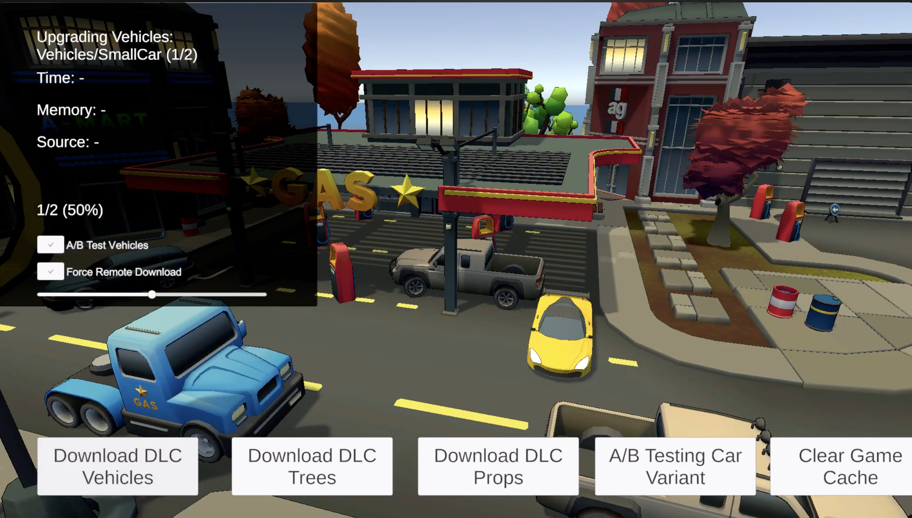
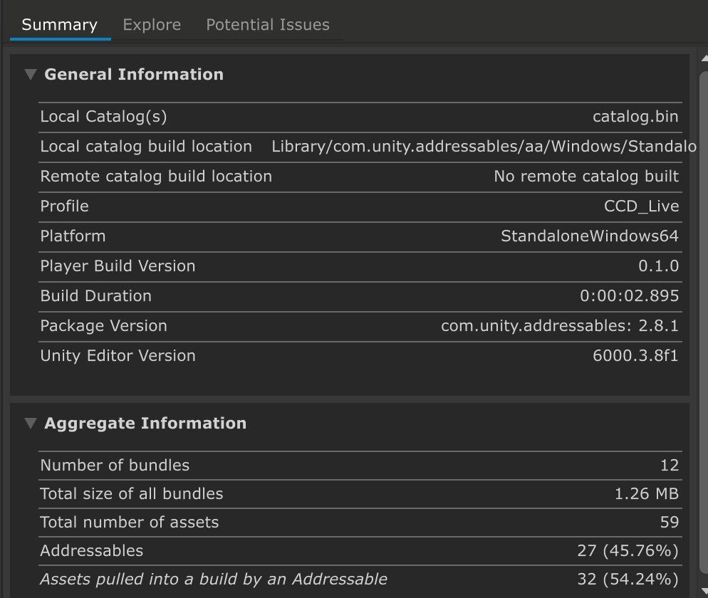
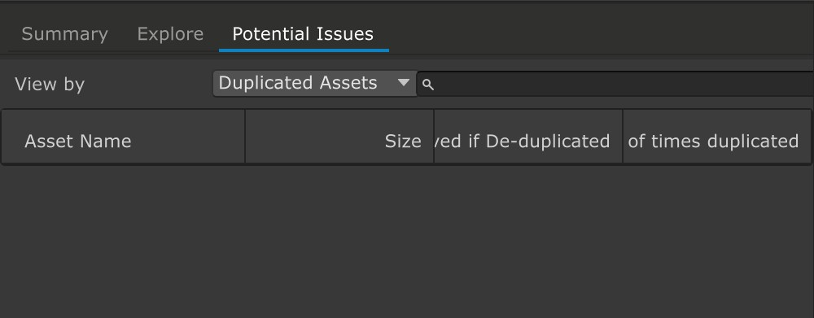
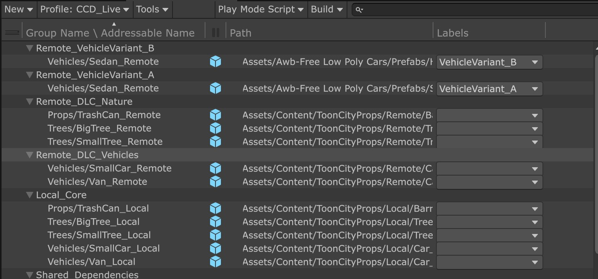

# Advanced Addressables + Live-Ops Content Pipeline

### Project Highlights
- Remote DLC loader with **local fallback** (offline resilience)
- Dynamic bundle patching via **Unity CCD** (no app resubmit)
- Isolated **A/B variant testing** (label-based, runtime switchable)
- Dependency-safe instantiation (`InstantiateAsync`) → no mesh/material missing
- Real-time progress UI, load-time & memory metrics
- Object pooling, graceful error handling, retries & timeouts
- Fully configuration-driven via ScriptableObject

### Technologies & Best Practices
- Addressables + CCD (remote content delivery)
- Async/await + `InstantiateAsync` (performance & reliability)
- ObjectPool (GC-friendly spawning)
- ScriptableObject config (designer-friendly, hot-swappable)

### Why is this essential?
Live-service games demand small app sizes, frequent patches, data-driven A/B testing, and mobile/offline support.  
This prototype demonstrates exactly that: a production-ready content pipeline built for real-world live-ops constraints.

### Project Controls

- Download buttons will download from remote, or used cached files if it has already been downloaded.
- A/B testing button will change the model to its other variant
- Clear Game cache button clears game cache and loads the local models
- Force remote Toggle - to test remote download again, if cached files are downloaded (deletes cache and gets from remote)
- Stats panel displays time, memory , status and a small progress bar

### Prototype video

### Screenshots 

### Build Summary

### No Potential issues found by analyzer

**Description**: Duplicates were found, i fixed the problem by creating an addressable group called shared dependencies.

### Group organization

**Description**: You can see how the groups are organized into small bundles for each purpose.
